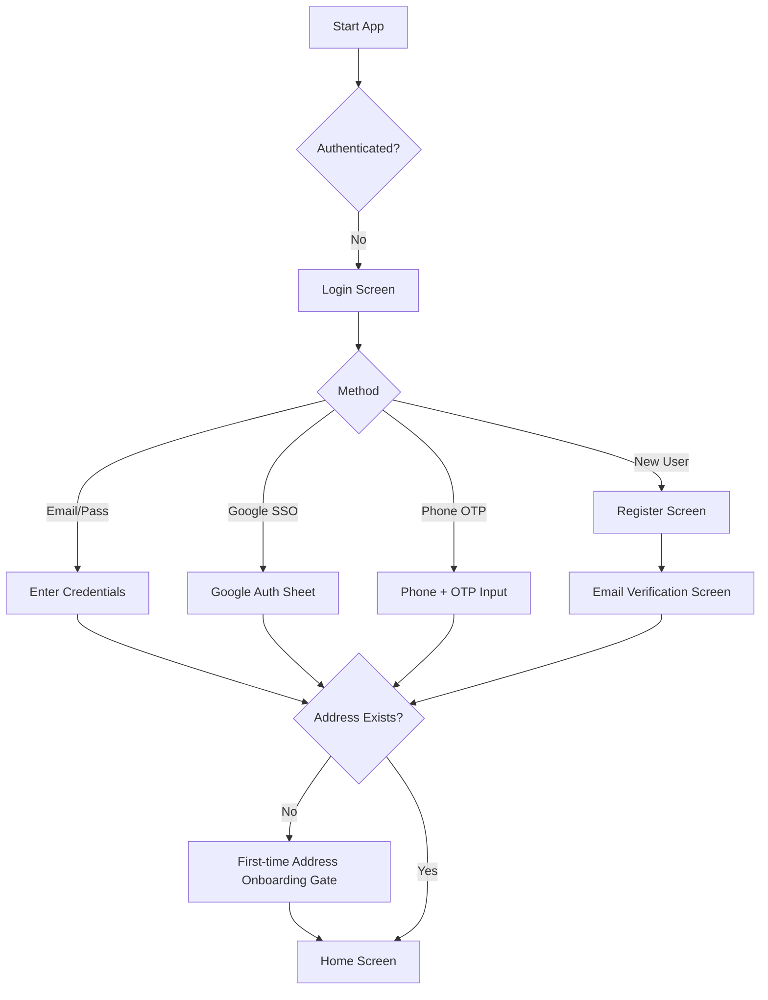
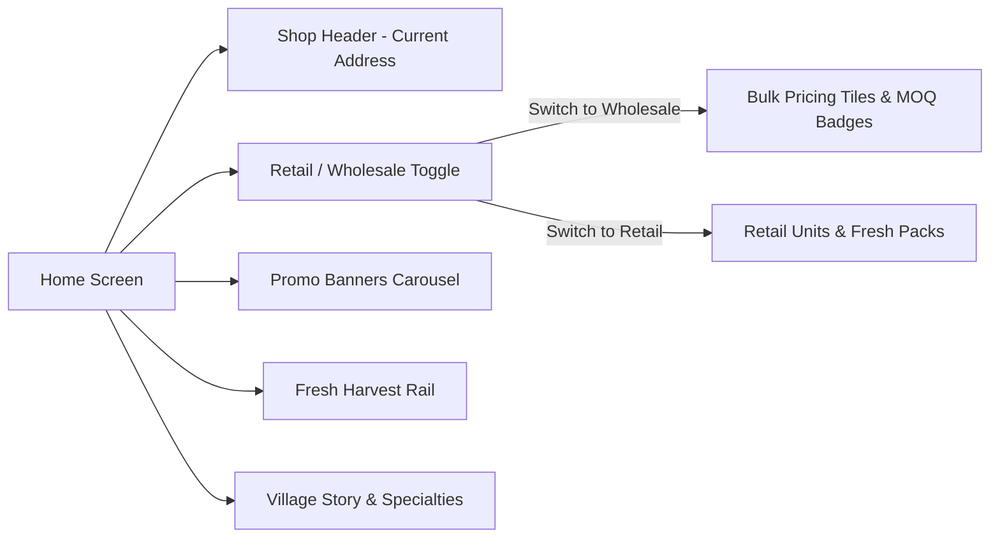
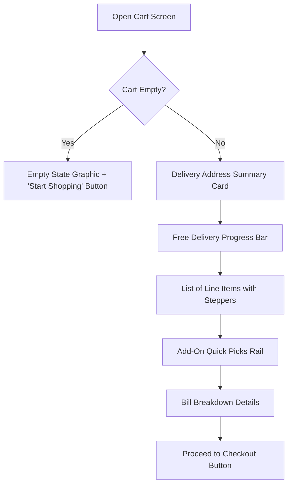
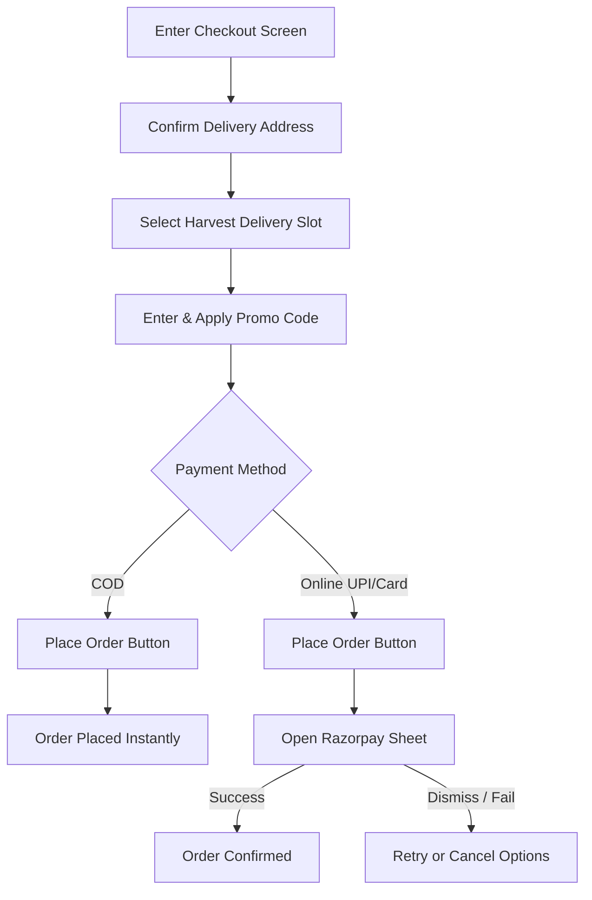
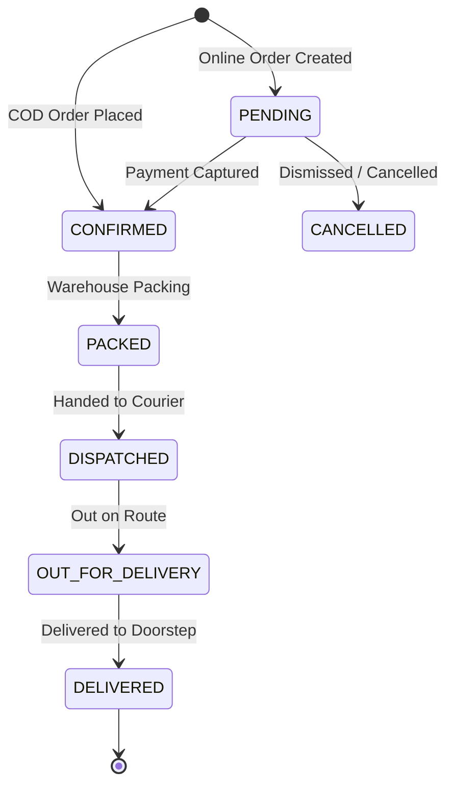

# Gawacha Bazaar — Customer Mobile App & User Experience
## End-to-End Manual Testing Specification & Test Scenarios

**Document Version:** 1.0.0  
**Effective Date:** October 2026  
**Target Applications:** 
- Gawacha Bazaar Customer Mobile Application (React Native / Expo on Android & iOS)
- Customer Web Experience (Landing & Showcase)
- Backend REST API Integration (FastAPI v1)
**Target Roles:** End-Consumer (Retail Buyer), Bulk / Wholesale Buyer, QA Engineers, Release Managers  
**Status:** Active / Ready for Execution  

---

## 1. Document Control & Test Strategy

### 1.1 Purpose
This document provides a comprehensive, production-grade manual test suite covering all customer-facing workflows of the Gawacha Bazaar platform. It ensures strict adherence to business rules, state machines (orders, payments, fulfillment, refunds, and bulk requests), UI design fidelity, data consistency, and network resilience.

### 1.2 Scope & Boundaries
- **In Scope:**
  - Customer Authentication, Social Sign-In (Google OAuth), Phone OTP, Account Linking, and Password Recovery.
  - First-time Address Onboarding Gate (`(onboarding)/address`).
  - Home Screen discovery, Promo Carousel, Retail vs. Wholesale mode switching, and Fresh Harvest rails.
  - Catalog browsing, Curated Department filters, Product Details Page (PDP), and Variant selection.
  - Real-time Product Search with query debouncing and category filtering.
  - Shopping Cart management, Addon recommendations, and Free Delivery threshold calculation.
  - Delivery Address Book CRUD, GPS reverse geocoding, and default address promotion.
  - Checkout flow, Harvest delivery slot selection, Coupon/Promo code evaluation, Farmer Impact calculations.
  - Payment flows: Cash on Delivery (COD) and Online Payments (Razorpay WebView/Sheet for UPI, Cards, NetBanking), payment retries, dismissals, and pending webhook handling.
  - Order Lifecycle tracking (PENDING → CONFIRMED → PACKED → DISPATCHED → OUT_FOR_DELIVERY → DELIVERED).
  - Customer-initiated Order Cancellations and Refund tracking (PENDING_APPROVAL → APPROVED → PROCESSING → REFUNDED).
  - Bulk / Wholesale Commerce: MOQ handling, custom quote request builder, quote review, and quote conversion.
  - Customer Profile, Mobile Number Verification, Settings, and Help & Support.
  - Non-functional and edge scenarios: Token silent refresh, offline modes, stock exhaustion during checkout, and form validation resilience.
- **Out of Scope for Customer Testing:**
  - Internal staff management and warehouse inventory picking algorithms (covered under Admin / Ops Test Plan).
  - Direct database manipulation.

### 1.3 Test Severity & Priority Matrix

| Priority | Definition | Release Blocker? | Example |
| :--- | :--- | :--- | :--- |
| **P0 (Critical)** | Core critical path. App crashes, blocked checkout, lost money, broken login. | **YES** | User unable to place COD or Razorpay order; Auth crashes app. |
| **P1 (High)** | Major functional path. High business impact or severe customer confusion. | **YES** | Promo code discount not deducted; Address cannot be saved; Cart resets unexpectedly. |
| **P2 (Medium)** | Secondary functional path or edge case. Workaround exists. | **NO (Review)** | Search results empty state typo; Add-on rail horizontal scroll stutter. |
| **P3 (Low)** | Minor cosmetic, styling, or layout polish issue. | **NO** | Subtle badge padding off by 2px; Struck-through price alignment. |

### 1.4 Test Environment & Setup Prerequisites

1. **Backend Server:**
   - FastAPI running locally (`http://<LAN_IP>:8000`) or Staging (`https://staging-api.gawachabazaar.com`).
   - Clean seed database populated with categories, products, variants, and active promotional codes (`FRESH100`, `WELCOME50`).
2. **Mobile Device / Emulators:**
   - Android Device / Emulator running Android 11+ with Expo Go or Standalone Dev Client build (`GawachaBazaar-1.0.0.apk`).
   - iOS Device / Simulator running iOS 16+.
3. **Razorpay Sandbox Credentials:**
   - Razorpay Key ID configured in backend environment.
   - Test UPI Handle: `success@razorpay` (instant success), `failure@razorpay` (declined).
   - Test Card: `4012 0000 0000 0002` (CVV: `123`, Expiry: Any future date, OTP: `123456`).
4. **Test Accounts:**
   - `newuser@example.com` (Unregistered / Fresh account).
   - `shopper@example.com` (Registered with existing addresses and past orders).
   - `wholesale.buyer@example.com` (Account used for B2B bulk requests).

---

## 2. Test Suite 1: Authentication, Onboarding & Security (AUTH)



### TC-AUTH-001: New User Registration with Valid Credentials
- **Module:** Authentication
- **Priority:** P0 (Critical)
- **Preconditions:** Fresh test email not registered in system.
- **Test Steps:**
  1. Open the Gawacha Bazaar app.
  2. Tap "Sign up" / "Create your account".
  3. Enter First Name: `Ramesh`, Last Name: `Patil`.
  4. Enter Email: `ramesh.patil.test@example.com`.
  5. Enter Password: `FarmFresh@2026` (Meets uppercase, lowercase, number, 8+ chars).
  6. Enter Confirm Password: `FarmFresh@2026`.
  7. Tap "Create account".
- **Expected Result:**
  - Loading spinner appears on the submit button.
  - Backend returns HTTP 201.
  - App redirects to `/(auth)/verify-email` with confirmation instructions.
  - User session is initialized and stored securely in `expo-secure-store`.

### TC-AUTH-002: Registration Form Client-Side Validation
- **Module:** Authentication
- **Priority:** P1 (High)
- **Preconditions:** App is on Register screen.
- **Test Steps & Inputs:**
  - *Case A (Empty fields):* Tap "Create account" with empty form.
  - *Case B (Short name):* Enter First Name: `A`.
  - *Case C (Invalid email):* Enter Email: `ramesh@patil`.
  - *Case D (Weak password):* Enter Password: `farm`.
  - *Case E (Password mismatch):* Password: `FarmFresh@2026`, Confirm: `FarmFresh@2027`.
- **Expected Result:**
  - *Case A:* Inline field errors: "Enter your first name", "Enter your last name", "Enter your email address", "Enter a password".
  - *Case B:* Inline error: "Name must be at least 2 characters."
  - *Case C:* Inline error: "Enter a valid email address."
  - *Case D:* Inline error: "Use at least 8 characters. Add an uppercase letter. Add a number."
  - *Case E:* Inline error: "Passwords don't match."
  - No network request sent to backend until all validations pass.

### TC-AUTH-003: Duplicate Email Registration Conflict
- **Module:** Authentication
- **Priority:** P1 (High)
- **Preconditions:** Account with `shopper@example.com` already exists.
- **Test Steps:**
  1. Go to Register screen.
  2. Fill in details using `shopper@example.com` and valid password.
  3. Tap "Create account".
- **Expected Result:**
  - Red error banner appears at top of screen with message: *"An account with this email already exists. Please log in instead."*
  - Form fields retain user input so they don't have to retype everything.

### TC-AUTH-004: Standard Email/Password Login
- **Module:** Authentication
- **Priority:** P0 (Critical)
- **Preconditions:** User `shopper@example.com` exists with password `Password123!`.
- **Test Steps:**
  1. Open app to Login screen.
  2. Enter Email: `shopper@example.com`.
  3. Enter Password: `Password123!`.
  4. Tap "Log in".
- **Expected Result:**
  - Button enters loading state.
  - JWT tokens (access and refresh) saved to `expo-secure-store`.
  - AppGate directs user to `/(tabs)` Home screen (or Address onboarding if 0 addresses saved).

### TC-AUTH-005: Login with Incorrect Password or Unregistered User
- **Module:** Authentication
- **Priority:** P1 (High)
- **Preconditions:** App on Login screen.
- **Test Steps:**
  1. Enter `shopper@example.com` with password `WrongPassword999!`.
  2. Tap "Log in".
- **Expected Result:**
  - Clean error banner: *"Invalid email or password."* (No stack trace or 500 error).
  - Password field remains accessible for re-entry.

### TC-AUTH-006: Google SSO Sign-In Flow
- **Module:** Authentication (OAuth)
- **Priority:** P0 (Critical)
- **Preconditions:** Google Play Services available on device/emulator.
- **Test Steps:**
  1. On Login or Register screen, tap "Continue with Google".
  2. Select active Google account from the system modal.
  3. Grant requested profile permissions.
- **Expected Result:**
  - Google ID token relayed to backend auth endpoint.
  - Successful login, token persisted, user navigated to Home.
  - If user cancels sheet, modal closes cleanly with no disruptive error alert.

### TC-AUTH-007: Account Linking Conflict (Google SSO vs Email)
- **Module:** Authentication
- **Priority:** P1 (High)
- **Preconditions:** User previously registered via email/password `existing.user@gmail.com`.
- **Test Steps:**
  1. Tap "Continue with Google" using `existing.user@gmail.com`.
- **Expected Result:**
  - Backend recognizes email collision with password provider.
  - App navigates to `/(auth)/link-account`.
  - Screen clearly informs customer to enter their existing password to link Google sign-in.

### TC-AUTH-008: Phone Number & OTP Verification
- **Module:** Authentication (Phone)
- **Priority:** P1 (High)
- **Preconditions:** Device with SMS capability or test phone number configured in Firebase.
- **Test Steps:**
  1. Tap "Continue with Phone number".
  2. Enter 10-digit Indian phone number: `9876543210`.
  3. Tap "Send OTP".
  4. Enter 6-digit OTP code received.
- **Expected Result:**
  - Auto-advance on 6-digit entry or explicit "Verify" tap.
  - Successful verification directs user to Home or Address Onboarding.

### TC-AUTH-009: Forgot Password / Assisted Reset Flow
- **Module:** Authentication
- **Priority:** P2 (Medium)
- **Preconditions:** User forgotten password.
- **Test Steps:**
  1. On Login screen, tap "Forgot password?".
- **Expected Result:**
  - Screen opens explaining that Gawacha Bazaar enforces secure admin-assisted password resets.
  - Customer provided with direct support contacts (Helpline & WhatsApp link) to request password reset.

### TC-AUTH-010: Session Persistence Across App Termination
- **Module:** Authentication / Storage
- **Priority:** P0 (Critical)
- **Preconditions:** User is logged in.
- **Test Steps:**
  1. Force quit the app from Android Recent Apps / iOS App Switcher.
  2. Re-open the app.
- **Expected Result:**
  - App opens directly to `/(tabs)` Home screen without prompting for credentials.
  - User profile and cart state load seamlessly.

### TC-AUTH-011: User Logout & Cache Eviction
- **Module:** Authentication
- **Priority:** P1 (High)
- **Preconditions:** User logged in.
- **Test Steps:**
  1. Navigate to "Account" tab.
  2. Tap "Log out".
  3. Confirm logout alert.
- **Expected Result:**
  - Tokens cleared from `expo-secure-store`.
  - React Query queryCache invalidated.
  - User redirected to `/(auth)/login`.
  - Tapping device back button does NOT return to authenticated screens.

---

## 3. Test Suite 2: First-Time Onboarding & Address Gate (ONBD)

### TC-ONBD-001: Mandatory First Address Onboarding Gate
- **Module:** Onboarding Gate
- **Priority:** P0 (Critical)
- **Preconditions:** Newly registered user with zero addresses in database.
- **Test Steps:**
  1. Complete registration or first-time social sign-in.
  2. Observe where the AppGate redirects the user.
- **Expected Result:**
  - User is routed directly to `/(onboarding)/address`.
  - Main tab bar is hidden.
  - User cannot bypass this screen to reach the catalog without providing a delivery location.

### TC-ONBD-002: Auto-Detect GPS Location & Reverse Geocoding
- **Module:** Onboarding / Address
- **Priority:** P1 (High)
- **Preconditions:** Device GPS enabled; Location permissions prompt ready.
- **Test Steps:**
  1. On address onboarding screen, tap "Use current location".
  2. Grant "While using the app" permission when OS dialog prompts.
- **Expected Result:**
  - Location coordinates acquired and rounded to 6 decimal places (`roundCoord`).
  - Street, City, State, and Postal Code fields are auto-filled via reverse geocoding.
  - User can manually edit or append apartment/flat number in Address Line 1 or 2.

### TC-ONBD-003: Manual Address Entry & Validation
- **Module:** Address
- **Priority:** P1 (High)
- **Preconditions:** Address form open.
- **Test Steps:**
  1. Select Label: `Home`.
  2. Enter Address Line 1: `Flat 402, Green Meadows, MG Road`.
  3. Enter City: `Pune`, State: `Maharashtra`, Postal Code: `411001`.
  4. Leave Address Line 1 blank and tap "Save address".
- **Expected Result:**
  - Validation error prevents submission: *"Address line 1 is required."*
  - Upon filling Address Line 1 and saving, address is committed to database via `POST /addresses`.

### TC-ONBD-004: First Address Auto-Assigned as Default
- **Module:** Address Service
- **Priority:** P1 (High)
- **Preconditions:** First address being submitted.
- **Test Steps:**
  1. Save first address.
  2. Check address details.
- **Expected Result:**
  - Backend automatically flags `is_default = true` on the customer's sole address.
  - AppGate unlocks and transitions user to `/(tabs)` Home screen.

---

## 4. Test Suite 3: Home Screen, Store Modes & Discovery (HOME)



### TC-HOME-001: Home Screen Layout & Initial Data Render
- **Module:** Home Screen
- **Priority:** P0 (Critical)
- **Preconditions:** Backend running, seed products present.
- **Test Steps:**
  1. Navigate to Home tab.
  2. Observe rendered components from top to bottom.
- **Expected Result:**
  - Top Shop Header displays default delivery address and postal code.
  - Search bar placeholder: *"Search for atta, rice, milk..."*.
  - Promotional carousel auto-scrolls or allows manual swiping.
  - Store Mode toggle (Retail / Wholesale) visible.
  - Fresh Harvest and Specialty rails render product cards with prices in ₹ (INR).
  - Floating Cart Bar appears if items are already in basket.

### TC-HOME-002: Pull-to-Refresh Data Invalidation
- **Module:** Home Screen
- **Priority:** P2 (Medium)
- **Preconditions:** App on Home screen.
- **Test Steps:**
  1. Drag down from the top of the screen to trigger pull-to-refresh spinner.
  2. Release.
- **Expected Result:**
  - Spinner activates with primary forest-green tint.
  - `queryClient.invalidateQueries` triggers fresh fetch for `categories`, `products`, and `addresses`.
  - Spinner dismisses once requests complete, reflecting any updated prices or stock.

### TC-HOME-003: Store Mode Switcher (Retail ⇄ Wholesale)
- **Module:** Wholesale Store
- **Priority:** P0 (Critical)
- **Preconditions:** User on Home screen.
- **Test Steps:**
  1. Tap "Wholesale" on the `WholesaleToggle`.
  2. Observe changes in the product feed.
  3. Tap back to "Retail".
- **Expected Result:**
  - When Wholesale is active:
    - Eyebrow changes to `WHOLESALE` with gold/mustard accent.
    - Headline displays *"Bulk pricing & institutional supply"*.
    - Product cards show wholesale pricing tiers, crate/bag quantities, and Minimum Order Quantities (MOQ).
    - Tapping a wholesale card directs to `/bulk/[id]` quote request flow.
  - Switching back to Retail restores standard household packaging and pricing.

### TC-HOME-004: Promotional Banner Carousel Interaction
- **Module:** Promotions / Navigation
- **Priority:** P2 (Medium)
- **Preconditions:** Home screen active.
- **Test Steps:**
  1. Swipe left/right across the promo banners.
  2. Tap on any banner slide.
- **Expected Result:**
  - Smooth carousel paging animation.
  - Tapping a banner routes user directly to `/(tabs)/categories` with relevant focus.

---

## 5. Test Suite 4: Catalog, Categories & Department Navigation (CAT)

### TC-CAT-001: Category List & Real Photography Tiles
- **Module:** Categories
- **Priority:** P1 (High)
- **Preconditions:** Categories seeded (Vegetables, Fruits, Dairy, Staples).
- **Test Steps:**
  1. Tap "Categories" in the bottom tab bar.
  2. Inspect category tiles.
- **Expected Result:**
  - Categories display high-resolution real produce photography (not generic vector clip-arts).
  - Item count badge shows total number of available products per category.

### TC-CAT-002: Curated Department Pills / Filtering
- **Module:** Categories
- **Priority:** P1 (High)
- **Preconditions:** Tap into "Fresh Vegetables" category.
- **Test Steps:**
  1. Observe department filter pills at top (e.g., "All", "Daily Essentials", "Leafy Greens", "Root Veggies").
  2. Tap "Leafy Greens".
- **Expected Result:**
  - Active pill highlights with primary green fill.
  - Grid instantly filters down to matching leafy items (Spinach, Fenugreek, Coriander).
  - Product count updates accordingly.

### TC-CAT-003: Infinite Scrolling & Product Grid Rendering
- **Module:** Catalog Listing
- **Priority:** P1 (High)
- **Preconditions:** Category containing > 20 products.
- **Test Steps:**
  1. Scroll down to the bottom of the category listing.
- **Expected Result:**
  - Secondary loading skeleton / spinner appears at the bottom.
  - Next page loads smoothly without jumping scroll position.
  - Each product card displays product title, unit/variant label, price, and "Add" button.

### TC-CAT-004: Out-of-Stock Product Display
- **Module:** Catalog / Stock
- **Priority:** P1 (High)
- **Preconditions:** A product variant has 0 stock in warehouse.
- **Test Steps:**
  1. Locate the out-of-stock product in listing.
- **Expected Result:**
  - Product image appears subtly dimmed or displays an "Out of Stock" pill.
  - "Add" button is disabled or replaced with "Sold Out" text.
  - Tapping the card still allows opening PDP to view details, but adding to cart is blocked.

---

## 6. Test Suite 5: Product Details Page (PDP)

### TC-PDP-001: Product Details Rendering & Origin Metadata
- **Module:** PDP
- **Priority:** P0 (Critical)
- **Preconditions:** Product has image, description, and embellishment data.
- **Test Steps:**
  1. Tap "Ripe Tomatoes" from Home or Category screen.
  2. Review PDP layout.
- **Expected Result:**
  - High-resolution hero image with pinch-to-zoom or smooth scroll.
  - English Name: "Ripe Tomatoes", Marathi Name: "टोमॅटो" (Tomato).
  - Farm Origin badge (e.g., *"Harvested in Junnar, Pune"*).
  - Expected delivery ETA pill (e.g., *"Delivered by tomorrow morning 7 AM"*).
  - Clear price tag in ₹.

### TC-PDP-002: Variant Selection & Real-Time Price Adjustment
- **Module:** PDP / Variants
- **Priority:** P0 (Critical)
- **Preconditions:** Product has multiple variants (e.g., 500g @ ₹30, 1kg @ ₹55, 2kg @ ₹100).
- **Test Steps:**
  1. Open PDP for multi-variant product.
  2. Note default selected variant (lowest price/unit).
  3. Tap "1 kg" variant pill.
  4. Tap "2 kg" variant pill.
- **Expected Result:**
  - Selected pill highlights with border and active background.
  - Display price updates immediately to match selected variant price.
  - If a specific variant is out of stock, its pill indicates "Out of stock" and disables selection.

### TC-PDP-003: Strike-Through MRP & Calculated Savings
- **Module:** PDP
- **Priority:** P2 (Medium)
- **Preconditions:** Product configured with illustrative MRP.
- **Test Steps:**
  1. Observe price presentation block.
- **Expected Result:**
  - Gawacha Bazaar selling price displayed in prominent bold typography (`priceLarge`).
  - Struck-through MRP displayed adjacent in muted grey (`textMuted`).
  - Discount tag shown (e.g., *"Save ₹15"* or *"20% OFF"*).

### TC-PDP-004: "Add to Basket" & In-Line Quantity Stepper
- **Module:** PDP / Cart Integration
- **Priority:** P0 (Critical)
- **Preconditions:** Item not currently in basket.
- **Test Steps:**
  1. On PDP, tap "Add to Basket".
  2. Observe UI change on the button.
  3. Tap `+` (increment) button.
  4. Tap `-` (decrement) button.
- **Expected Result:**
  - On first tap, button transforms into an active Quantity Stepper (`-  1  +`).
  - Bottom Floating Cart Bar animates into view showing updated item count and subtotal.
  - Tapping `+` updates count to `2` and updates Cart Bar amount in real-time.
  - Tapping `-` down to `0` reverts button back to "Add to Basket" and removes item from cart.

---

## 7. Test Suite 6: Search & Filtering (SRCH)

### TC-SRCH-001: Search Input & Real-Time Debounce
- **Module:** Search
- **Priority:** P1 (High)
- **Preconditions:** Search screen open (`/(tabs)/search`).
- **Test Steps:**
  1. Tap into search input field.
  2. Type `on`.
  3. Wait 300ms, then continue typing `ion`.
- **Expected Result:**
  - Search query triggers backend `GET /catalog/products?q=onion` after debouncing.
  - Network request is not flooded per keystroke.
  - Results matching "Fresh Red Onion", "White Onion" render on screen.

### TC-SRCH-002: Add to Basket Directly from Search Grid
- **Module:** Search
- **Priority:** P1 (High)
- **Preconditions:** Search results displayed.
- **Test Steps:**
  1. Tap "Add" button on a search result card.
- **Expected Result:**
  - Item is added to cart without leaving search screen.
  - Quantity stepper appears on the card.
  - Floating Cart Bar at bottom updates item total.

### TC-SRCH-003: Zero Search Results & Recommendation Fallback
- **Module:** Search
- **Priority:** P2 (Medium)
- **Preconditions:** Search for non-existent item.
- **Test Steps:**
  1. Enter search query: `xyznonexistentproduce123`.
- **Expected Result:**
  - Empty state graphic with message: *"No fresh items found matching 'xyznonexistentproduce123'"*.
  - Suggestion text: *"Try searching for milk, potatoes, or fresh vegetables"*.
  - "Clear search" button to reset query.

---

## 8. Test Suite 7: Shopping Basket / Cart Management (CART)



### TC-CART-001: Cart Screen Opening & Empty State
- **Module:** Cart
- **Priority:** P1 (High)
- **Preconditions:** Cart has 0 items.
- **Test Steps:**
  1. Tap Cart icon in header or navigate to `/cart`.
- **Expected Result:**
  - Clean empty state view: *"Your cart is empty"*, *"Find something you'll love."*.
  - Primary button: "Start shopping" routes user to `/(tabs)` Home.

### TC-CART-002: Line Item Display & Embellishments
- **Module:** Cart
- **Priority:** P0 (Critical)
- **Preconditions:** Cart contains 2 items (e.g., 1kg Tomatoes @ ₹55, 500ml Milk @ ₹32).
- **Test Steps:**
  1. Open `/cart`.
  2. Inspect line item rows.
- **Expected Result:**
  - Each item displays:
    - Product thumbnail image (`primary_image_url`).
    - Product title and selected pack size/variant.
    - Unit price and multiplied line total (`quantity * price`).
    - Interactive quantity stepper (`-  Q  +`).

### TC-CART-003: Stepper Increment & Decrement Synchronization
- **Module:** Cart
- **Priority:** P0 (Critical)
- **Preconditions:** Item quantity is 1.
- **Test Steps:**
  1. Tap `+` on the Tomatoes line item.
  2. Observe line total and overall bill.
  3. Tap `-` once.
  4. Tap `-` once more.
- **Expected Result:**
  - Tapping `+`: Quantity changes to 2, line total changes to ₹110, cart total increases by ₹55.
  - Tapping `-`: Quantity returns to 1, totals decrease accordingly.
  - Tapping `-` at quantity 1 triggers line item removal with smooth exit animation.

### TC-CART-004: Free Delivery Threshold Calculation
- **Module:** Cart / Free Delivery
- **Priority:** P1 (High)
- **Preconditions:** Free delivery threshold set at ₹299; Delivery fee is ₹30.
- **Test Steps:**
  1. Add items totaling ₹180 to cart.
  2. Open cart and check `FreeDeliveryProgress`.
  3. Add items totaling ₹130 (Cart total becomes ₹310).
  4. Re-check `FreeDeliveryProgress`.
- **Expected Result:**
  - At ₹180: Progress bar is ~60% filled with text: *"Add ₹119 more for FREE delivery"*. Bill includes ₹30 delivery charge.
  - At ₹310: Progress bar fills 100% with celebration icon: *"You unlocked FREE delivery!"*. Delivery fee changes to ₹0 / Free.

### TC-CART-005: Add-On Recommendations Rail
- **Module:** Cart / Addons
- **Priority:** P2 (Medium)
- **Preconditions:** Fresh Lemons and Green Chillies not in cart.
- **Test Steps:**
  1. Scroll down cart screen to "Popular additions" rail.
  2. Tap "+ Add" on "Fresh Lemons".
- **Expected Result:**
  - Lemons immediately added into the main basket list.
  - Lemons tile disappears from the add-on recommendation rail to prevent duplicates.
  - Bill breakdown recalculates automatically.

### TC-CART-006: Clear Cart Action & Confirmation
- **Module:** Cart
- **Priority:** P2 (Medium)
- **Preconditions:** Multiple items in cart.
- **Test Steps:**
  1. Tap "Clear cart" / Trash icon at top of basket list.
  2. System displays alert: *"Clear your cart? This will remove all items."*
  3. Tap "Clear".
- **Expected Result:**
  - `DELETE /cart` sent to backend.
  - Cart empties immediately and transitions to Empty Cart State.

---

## 9. Test Suite 8: Delivery Address Book Management (ADDR)

### TC-ADDR-001: Saved Addresses List & Default Badge
- **Module:** Address Book
- **Priority:** P1 (High)
- **Preconditions:** User has 2 saved addresses (Home - default, Work).
- **Test Steps:**
  1. Navigate to "Account" tab → "Saved addresses" (`/address`).
- **Expected Result:**
  - List displays both addresses with label, complete street address, and phone number.
  - "Home" address displays a prominent "Default" badge.

### TC-ADDR-002: Add New Address with Manual Entry
- **Module:** Address Book
- **Priority:** P1 (High)
- **Preconditions:** On Saved Addresses screen.
- **Test Steps:**
  1. Tap "Add new address" (`/address/add`).
  2. Select quick chip: `Work`.
  3. Enter Address Line 1: `Tech Park, Tower B, 4th Floor`.
  4. Enter Address Line 2: `Hinjawadi Phase 1`.
  5. Enter City: `Pune`, State: `Maharashtra`, Postal Code: `411057`.
  6. Tap "Save address".
- **Expected Result:**
  - Toast notification appears: *"Address saved"*.
  - User returned to address list; new "Work" address appears in list.

### TC-ADDR-003: GPS Coordinates Decimal Precision
- **Module:** Address / Backend Contract
- **Priority:** P1 (High)
- **Preconditions:** Adding address via GPS.
- **Test Steps:**
  1. Tap "Use current location".
  2. Verify network payload sent to `POST /addresses`.
- **Expected Result:**
  - Coordinates rounded to maximum 6 decimal places (e.g. `18.520430`, `73.856743`).
  - Request successfully accepted with HTTP 201 (prevents backend `Decimal(9,6)` 422 Unprocessable Entity error).

### TC-ADDR-004: Set Existing Address as Default
- **Module:** Address Book
- **Priority:** P1 (High)
- **Preconditions:** Two addresses exist, "Work" is not default.
- **Test Steps:**
  1. On `/address`, tap "Make default" on the "Work" address.
- **Expected Result:**
  - "Default" badge moves to "Work".
  - Home screen and Checkout screen immediately update to show "Work" as default selected address.

### TC-ADDR-005: Delete Address Validation
- **Module:** Address Book
- **Priority:** P2 (Medium)
- **Preconditions:** User has 2 addresses.
- **Test Steps:**
  1. Tap Delete icon on the non-default address.
  2. Confirm deletion dialog.
- **Expected Result:**
  - Address removed from database.
  - If user attempts to delete the ONLY remaining address in the account, action is either blocked or informs user that a delivery address is required.

---

## 10. Test Suite 9: Checkout, Discounts & Slot Selection (CHK)



### TC-CHK-001: Navigation to Checkout & Pre-Populated Defaults
- **Module:** Checkout
- **Priority:** P0 (Critical)
- **Preconditions:** Cart contains active items.
- **Test Steps:**
  1. On Cart screen, tap "Proceed to checkout".
  2. Review checkout sections.
- **Expected Result:**
  - Delivery address card pre-selects customer's default address.
  - Delivery slot pre-selects earliest available harvest window.
  - Payment method defaults to Cash on Delivery (COD) or previous choice.
  - Total amount matches cart bill.

### TC-CHK-002: Delivery Slot Selection
- **Module:** Checkout / Harvest Slot
- **Priority:** P1 (High)
- **Preconditions:** Checkout screen active.
- **Test Steps:**
  1. Observe `HarvestSlotSelector`.
  2. Switch from "Tomorrow Morning (6:00 AM - 9:00 AM)" to "Tomorrow Evening (5:00 PM - 8:00 PM)".
- **Expected Result:**
  - Slot card toggles active styling with green border.
  - Slot preference saved in checkout state.

### TC-CHK-003: Apply Valid Promotional Coupon Code
- **Module:** Promotions / Checkout
- **Priority:** P0 (Critical)
- **Preconditions:** Active promo `FRESH100` configured for ₹100 off on min order ₹300. Cart total is ₹450.
- **Test Steps:**
  1. In the promo code input, type `FRESH100`.
  2. Tap "Apply".
- **Expected Result:**
  - `POST /promotions/evaluate` returns `eligible: true`.
  - Green discount pill appears: *"FRESH100 applied: ₹100 saved"*.
  - Bill breakdown adds "Coupon Discount: -₹100.00".
  - Final payable amount reduces from ₹450 to ₹350.

### TC-CHK-004: Apply Invalid / Expired / Below Minimum Promo Code
- **Module:** Promotions
- **Priority:** P1 (High)
- **Preconditions:** Promo `MIN500` requires ₹500 min cart. Current cart is ₹250.
- **Test Steps:**
  1. Type `MIN500` and tap "Apply".
  2. Clear and type `EXPIRED99` and tap "Apply".
- **Expected Result:**
  - `MIN500`: Error message below input: *"Minimum order value of ₹500 required for this coupon."*.
  - `EXPIRED99`: Error message: *"Invalid or expired promo code."*.
  - Bill breakdown total remains unchanged.

### TC-CHK-005: Remove Applied Promo Code
- **Module:** Promotions
- **Priority:** P1 (High)
- **Preconditions:** Promo code `FRESH100` is currently applied.
- **Test Steps:**
  1. Tap "Remove" (or cross icon) on the applied promo badge.
- **Expected Result:**
  - Promo code removed.
  - Discount line item disappears from bill breakdown.
  - Total payable returns to original pre-discount amount.

---

## 11. Test Suite 10: Payments & Order Confirmation (PAY)

### TC-PAY-001: Place Order with Cash on Delivery (COD)
- **Module:** Checkout / Payments
- **Priority:** P0 (Critical)
- **Preconditions:** Cart has items, default address selected, COD chosen.
- **Test Steps:**
  1. On Checkout screen, ensure "Cash on Delivery" radio is selected.
  2. Tap "Place order (₹XXX)".
- **Expected Result:**
  - Button shows loading spinner.
  - Backend creates order in `CONFIRMED` status with payment status `PENDING` (COD).
  - Cart is cleared.
  - App replaces route to `/checkout/success?orderId=<NEW_ID>`.
  - Success screen displays:
    - Celebration green checkmark icon.
    - Order Number (e.g. `GB-2026-XXXX`).
    - Payment mode: *"Cash on Delivery"*.
    - Button: "Track order" and "Continue shopping".

### TC-PAY-002: Place Order with Online Payment (Razorpay UPI Instant Success)
- **Module:** Payments / Razorpay
- **Priority:** P0 (Critical)
- **Preconditions:** Razorpay test keys enabled on backend.
- **Test Steps:**
  1. On Checkout screen, select "Pay online (UPI / Card / NetBanking)".
  2. Tap "Pay ₹XXX".
  3. Razorpay Checkout modal/WebView opens.
  4. Select "UPI" → Enter test VPA: `success@razorpay`.
  5. Authorize test payment.
- **Expected Result:**
  - Razorpay reports success callback to mobile app with `razorpay_payment_id`, `razorpay_order_id`, and `razorpay_signature`.
  - App relays payload to `POST /payments/{id}/confirm`.
  - Payment status becomes `PAID` and order status becomes `CONFIRMED`.
  - User redirected to `/checkout/success?orderId=<NEW_ID>`.

### TC-PAY-003: Razorpay Modal Dismissed / Back Out by User
- **Module:** Payments / Edge Cases
- **Priority:** P1 (High)
- **Preconditions:** Razorpay sheet is open for an online order.
- **Test Steps:**
  1. Tap the "X" (close) button or press Android hardware back button inside Razorpay sheet.
- **Expected Result:**
  - Modal dismisses cleanly without crashing.
  - App checks payment status. Since uncompleted, app presents a friendly recovery view:
    - *"Complete your payment"*.
    - Option 1: "Try paying again" (re-opens payment sheet with same order).
    - Option 2: "Cancel this order" (cancels the pending order so customer can switch to COD if desired).

### TC-PAY-004: Online Payment Failure / Bank Decline
- **Module:** Payments / Errors
- **Priority:** P0 (Critical)
- **Preconditions:** Razorpay sheet open.
- **Test Steps:**
  1. Enter failing UPI ID `failure@razorpay` or enter invalid OTP.
  2. Submit payment.
- **Expected Result:**
  - Razorpay shows payment failure message.
  - Mobile app surfaces safe error message: *"Payment could not be completed by your bank. Please try another method."*.
  - Order is not marked CONFIRMED; customer is given retry button or can switch to COD.

### TC-PAY-005: Delayed Payment Capture (Webhook Fallback)
- **Module:** Payments
- **Priority:** P1 (High)
- **Preconditions:** Payment debited at bank, but app network disconnected before confirm API returned.
- **Test Steps:**
  1. Trigger payment debit.
  2. Disconnect app network before `/confirm` endpoint returns.
  3. Razorpay webhook fires to backend `POST /webhooks/razorpay`.
  4. Re-open app and navigate to Orders screen.
- **Expected Result:**
  - Backend webhook processes the capture and transitions payment to `PAID` and order to `CONFIRMED`.
  - When customer views the order in Orders tab, status accurately reflects *"Confirmed"* (not pending or failed).

---

## 12. Test Suite 11: Order Lifecycle, History & Tracking (ORD)



### TC-ORD-001: Active vs. Previous Orders Split
- **Module:** Orders Tab
- **Priority:** P1 (High)
- **Preconditions:** User has 1 active order (`CONFIRMED`) and 1 older order (`DELIVERED`).
- **Test Steps:**
  1. Navigate to "Orders" tab (`/(tabs)/orders`).
- **Expected Result:**
  - Top section displays "Active orders" with current order card, live status badge, and item thumbnails.
  - Lower section displays "Past orders" with completed order cards and date.
  - Pull-to-refresh works to update order cards.

### TC-ORD-002: Order Details Screen Hierarchy
- **Module:** Order Details
- **Priority:** P0 (Critical)
- **Preconditions:** Order placed.
- **Test Steps:**
  1. Tap an active order card (`/order/[id]`).
  2. Verify all sections.
- **Expected Result:**
  - Header: Order Number (`GB-2026-XXXX`) and Placed Date.
  - Status Timeline card showing current fulfillment progress.
  - Items list with product names, pack quantities, item prices, and Total sum.
  - Delivery Address card matching selected delivery location.
  - Payment card displaying method (COD / Online Razorpay) and status badge (`Paid` / `Payment pending`).
  - If order is in cancellable state, "Cancel order" button is visible at the bottom.

### TC-ORD-003: Fulfillment Status Stepper Progression
- **Module:** Order Tracking
- **Priority:** P1 (High)
- **Preconditions:** Order is being fulfilled by operations team.
- **Test Steps & Status Verifications:**
  - *Step 1:* Order placed → Stepper shows: `Order received` (Green active dot).
  - *Step 2:* Ops sets status to `PACKED` → Stepper shows: `Packed` with checkmark on previous steps.
  - *Step 3:* Ops assigns rider (`ASSIGNED` / `DISPATCHED`) → Stepper shows: `Ready for dispatch` / `Delivery assigned`.
  - *Step 4:* Rider begins delivery (`OUT_FOR_DELIVERY`) → Stepper displays highlighted amber pill: `Out for delivery`.
  - *Step 5:* Rider confirms handover (`DELIVERED`) → Stepper reaches terminal green check: `Delivered`.
- **Expected Result:**
  - UI labels strictly match `presentFulfillmentStatus` definitions.
  - No broken state transitions or blank labels.

### TC-ORD-004: Unpaid Online Order Recovery Flow
- **Module:** Order Recovery
- **Priority:** P1 (High)
- **Preconditions:** User placed order online but exited before completing payment (Status: `PENDING`).
- **Test Steps:**
  1. Open the pending order from Orders list.
- **Expected Result:**
  - Amber banner appears: *"Payment is pending for this order"*.
  - Primary button: "Complete payment" is visible.
  - Tapping button triggers Razorpay checkout flow to complete payment directly.

---

## 13. Test Suite 12: Order Cancellation & Refund Management (CAN-REF)

### TC-CAN-001: Customer Cancellation in Eligible State
- **Module:** Cancellation
- **Priority:** P0 (Critical)
- **Preconditions:** Order is in `CONFIRMED` status; Fulfillment is before `DISPATCHED`.
- **Test Steps:**
  1. Open Order Details screen.
  2. Tap "Cancel order" button at bottom.
  3. App navigates to `/order/[id]/cancel`.
  4. Select reason: *"Found a better price elsewhere"*.
  5. Tap "Confirm cancellation".
  6. In confirmation alert (*"This can't be undone."*), tap "Yes, cancel order".
- **Expected Result:**
  - `POST /orders/{id}/cancel` sent to backend with selected reason payload.
  - Success toast: *"Order cancelled"*.
  - Order status updates to `CANCELLED` with red error-light badge.
  - If order was COD, process finishes with zero liability.

### TC-CAN-002: Customer Cancellation with Custom Reason ("Other")
- **Module:** Cancellation
- **Priority:** P2 (Medium)
- **Preconditions:** Order is cancellable.
- **Test Steps:**
  1. On `/order/[id]/cancel`, select radio button: `Other`.
  2. Text field appears: *"Tell us more (optional)"*.
  3. Enter custom text: `Traveling out of town unexpectedly`.
  4. Confirm cancellation.
- **Expected Result:**
  - Custom reason text is included in cancellation payload and stored in database.

### TC-CAN-003: Cancellation Prevention for Ineligible Orders
- **Module:** Cancellation / State Machine
- **Priority:** P0 (Critical)
- **Preconditions:** Order status is `DISPATCHED`, `OUT_FOR_DELIVERY`, or `DELIVERED`.
- **Test Steps:**
  1. Open Order Details screen for a dispatched/delivered order.
- **Expected Result:**
  - "Cancel order" button is completely hidden from the UI (`isOrderCancellable` returns false).
  - If a user somehow invokes the cancel API directly, backend returns HTTP 409 Conflict.

### TC-CAN-004: Automatic Refund Request for Online Prepaid Orders
- **Module:** Refunds
- **Priority:** P0 (Critical)
- **Preconditions:** Customer cancels an order that was already `PAID` via Razorpay online.
- **Test Steps:**
  1. Cancel the paid online order.
  2. Inspect Order Details screen post-cancellation.
- **Expected Result:**
  - Backend automatically initializes a Refund record in status `PENDING_APPROVAL`.
  - Order details screen displays a "Refund status" card and link to `/order/[id]/refund`.

### TC-CAN-005: Refund Timeline & Status Tracking
- **Module:** Refund Tracking
- **Priority:** P1 (High)
- **Preconditions:** Cancelled prepaid order with refund record.
- **Test Steps:**
  1. Tap "Check refund status" (`/order/[id]/refund`).
  2. Inspect timeline steps:
     - `Refund requested` (PENDING_APPROVAL)
     - `Approved by GawachaBazaar` (APPROVED)
     - `Processing with bank` (PROCESSING)
     - `Refunded` (REFUNDED)
- **Expected Result:**
  - Refund amount displayed prominently in ₹.
  - Timeline dot illuminates up to current status step.
  - Screen clearly indicates that Gawacha Bazaar team reviews and approves online refunds before bank processing.

### TC-CAN-006: Rejected or Failed Refund Handling
- **Module:** Refunds
- **Priority:** P1 (High)
- **Preconditions:** Admin rejected refund or Razorpay refund API failed.
- **Test Steps:**
  1. Open `/order/[id]/refund` for rejected refund.
- **Expected Result:**
  - Red banner displays: *"This refund request was rejected. Contact support if you have questions."*.
  - Direct support link is provided to the customer.

---

## 14. Test Suite 13: Wholesale / Bulk Commerce Flow (BULK)

### TC-BULK-001: Browse Wholesale Catalog & Minimum Order Quantities
- **Module:** Wholesale
- **Priority:** P1 (High)
- **Preconditions:** Store mode toggled to "Wholesale".
- **Test Steps:**
  1. Browse products in wholesale mode.
  2. Inspect product cards.
- **Expected Result:**
  - Units reflect institutional packaging (e.g., 25 kg Bag, 50 kg Crate).
  - Minimum Order Quantity (MOQ) displayed (e.g., *"MOQ: 5 Bags"*).
  - Indicative bulk wholesale price per quintal / kg displayed.

### TC-BULK-002: Create Custom Bulk Quote Request
- **Module:** Wholesale Request Builder
- **Priority:** P0 (Critical)
- **Preconditions:** Tap on a wholesale product card.
- **Test Steps:**
  1. On `/bulk/[id]`, review product specifications.
  2. Input Target Quantity: `15 Bags (375 kg)`.
  3. Select Delivery Timeline / Target Date: `Within 3 days`.
  4. Enter Delivery Location & Special Instructions: `Deliver to Annapurna Restaurant central kitchen rear entrance`.
  5. Tap "Review request" (`/bulk/review`).
  6. Tap "Submit quote request".
- **Expected Result:**
  - Payload submitted via `POST /bulk-orders/requests`.
  - User navigated to `/bulk/success`.
  - Screen displays Request Reference ID (e.g., `WR-2026-XXXX`).
  - Explanation: *"Our farm procurement team will review your requirement and submit a custom rate quote within 2 business hours."*.

### TC-BULK-003: Track Bulk Requests List & Statuses
- **Module:** Wholesale Tracking
- **Priority:** P1 (High)
- **Preconditions:** User has submitted bulk requests.
- **Test Steps:**
  1. Navigate to `/bulk/requests`.
  2. Inspect request cards and status badges:
     - `REQUESTED` → "Request sent"
     - `UNDER_REVIEW` → "Under review"
     - `QUOTED` → "Quote ready"
     - `CUSTOMER_ACCEPTED` → "Quote accepted"
     - `CONVERTED_TO_ORDER` → "Converted to order"
- **Expected Result:**
  - All submitted requests listed with date, item name, and requested quantity.
  - Correct status badges rendered matching `presentBulkRequestStatus`.

### TC-BULK-004: Accept Quoted Wholesale Offer
- **Module:** Wholesale Quote Acceptance
- **Priority:** P1 (High)
- **Preconditions:** Request is in `QUOTED` status with admin pricing.
- **Test Steps:**
  1. Open `/bulk/[id]` for the quoted request.
  2. Review offered price per unit and total quote amount.
  3. Tap "Accept quote".
- **Expected Result:**
  - Status updates to `CUSTOMER_ACCEPTED`.
  - Ops can convert accepted quote into a formal bulk delivery order.

---

## 15. Test Suite 14: User Profile, Settings & Support (PROF)

### TC-PROF-001: View Profile & Account Information
- **Module:** Account
- **Priority:** P1 (High)
- **Preconditions:** User logged in.
- **Test Steps:**
  1. Navigate to "Account" tab (`/(tabs)/account`).
  2. Tap "Profile & Personal Details" (`/account/profile`).
- **Expected Result:**
  - User's Full Name, Email, and Phone Number (if linked) are displayed.
  - Account creation date shown.
  - Notice explaining that sensitive profile modifications (such as email changes) require verified support assistance.

### TC-PROF-002: Add / Link Mobile Number to Existing Account
- **Module:** Account
- **Priority:** P1 (High)
- **Preconditions:** User registered via email/password without a phone number.
- **Test Steps:**
  1. On Account screen, tap "Add phone number" (`/account/add-phone`).
  2. Enter 10-digit mobile number: `9123456780`.
  3. Tap "Send verification code".
  4. Enter received OTP code.
- **Expected Result:**
  - Mobile number linked to account in database.
  - Profile screen now shows phone number with a green "Verified" badge.

### TC-PROF-003: Customer Support Channels (WhatsApp, Helpline, Email)
- **Module:** Support
- **Priority:** P1 (High)
- **Preconditions:** On Account screen.
- **Test Steps:**
  1. Tap "Customer Support & FAQs" (`/account/support`).
  2. Tap "Chat on WhatsApp".
  3. Tap "Call Farm Helpline".
  4. Tap "Send Email".
- **Expected Result:**
  - "Chat on WhatsApp": Opens WhatsApp app with pre-filled support message addressed to Gawacha Bazaar official business number.
  - "Call Farm Helpline": Triggers device phone dialer with support number `+91-XXXX-XXXXXX`.
  - "Send Email": Triggers default mail client with `support@gawachabazaar.com`.

### TC-PROF-004: App Settings & Legal Links
- **Module:** Settings
- **Priority:** P2 (Medium)
- **Preconditions:** On Account screen.
- **Test Steps:**
  1. Tap "Settings & Privacy" (`/account/settings`).
  2. Review Version Number (e.g. `v1.0.0 (build 20)`).
  3. Tap "Terms of Service" and "Privacy Policy".
- **Expected Result:**
  - External links or in-app web views open respective legal policy documents.

---

## 16. Test Suite 15: Edge Cases, Network Resilience & Security (SEC-EDGE)

### TC-EDGE-001: Network Offline & Recovery Behavior
- **Module:** Network Resilience
- **Priority:** P0 (Critical)
- **Preconditions:** User browsing catalog.
- **Test Steps:**
  1. Enable Airplane mode on device (disconnect Wi-Fi and Cellular).
  2. Tap on a category or attempt to add an item to basket.
  3. Observe UI.
  4. Disable Airplane mode (reconnect network).
  5. Tap "Try again".
- **Expected Result:**
  - App does NOT crash.
  - Clean error banner / toast appears: *"No internet connection. Please check your network and try again."*.
  - Reconnecting and tapping "Try again" recovers smoothly without losing uncommitted cart state.

### TC-EDGE-002: Silent JWT Token Refresh Interceptor
- **Module:** Security / Auth
- **Priority:** P0 (Critical)
- **Preconditions:** User logged in. Access token expires after 15 minutes.
- **Test Steps:**
  1. Simulate access token expiration by waiting or manually shortening TTL in test environment.
  2. Perform an action that fires 3 concurrent API requests (e.g. loading cart, addresses, and order count simultaneously).
- **Expected Result:**
  - First 401 response triggers the single-flight refresh interceptor (`/auth/refresh`).
  - All concurrent requests wait on that single refresh call rather than firing separate refresh calls.
  - Fresh access token acquired, stored in SecureStore, and original requests replayed transparently.
  - User experiences zero interruption or logout.

### TC-EDGE-003: Expired or Revoked Refresh Token
- **Module:** Security / Auth
- **Priority:** P1 (High)
- **Preconditions:** User's refresh token expired or revoked by Admin in backend.
- **Test Steps:**
  1. Attempt an authenticated API request with revoked refresh token.
- **Expected Result:**
  - Interceptor receives 401 from `/auth/refresh`.
  - App immediately wipes stale tokens from `expo-secure-store`.
  - Auth store state transitions to `unauthenticated`.
  - AppGate navigates user to Login screen with clear toast: *"Your session has expired. Please log in again."*.

### TC-EDGE-004: Concurrency & Stock Depletion at Checkout
- **Module:** Inventory / Checkout
- **Priority:** P0 (Critical)
- **Preconditions:** Only 1 unit of "Organic Alphonso Mango Crate" left in stock.
- **Test Steps:**
  1. User A and User B both add the last unit to their baskets.
  2. User A taps "Place order" and completes checkout.
  3. User B taps "Place order" immediately after.
- **Expected Result:**
  - Backend inventory lock rejects User B's order with HTTP 409 Conflict.
  - User B's checkout surfaces human-readable error: *"One or more items in your cart is no longer available in the requested quantity."*.
  - Basket updates to indicate out-of-stock item without crashing checkout.

### TC-EDGE-005: Input Stress & Boundary Testing
- **Module:** Form Validation
- **Priority:** P2 (Medium)
- **Preconditions:** Address or Registration form.
- **Test Steps:**
  1. In Name / Address fields, enter SQL strings: `' OR 1=1 --`.
  2. Enter Script tags: `<script>alert('hack')</script>`.
  3. Enter 500 emojis: `🥬🍅🥕🌾...`.
- **Expected Result:**
  - Client and backend Pydantic validation safely sanitize/encode or reject inputs exceeding max character limits.
  - No database injection, XSS execution, or 500 crashes.

### TC-EDGE-006: Keyboard Avoidance & Screen Orientation
- **Module:** UI / Usability
- **Priority:** P1 (High)
- **Preconditions:** Bottom sheet or input form (e.g. Add Address, Login).
- **Test Steps:**
  1. Tap input at bottom of screen (e.g. Postal code or Confirm password).
  2. Observe keyboard appearance.
- **Expected Result:**
  - Screen scrolls up dynamically via `KeyboardAvoidingView`.
  - Active input field and "Save" button remain fully visible above the virtual keyboard.

---

## 17. Manual Test Execution Checklist & QA Sign-off Matrix

Testers can use this tabular checklist during test cycles to record results across test builds.

| Test ID | Module | Scenario Summary | Priority | Device / OS | Status (Pass/Fail/Block) | Defect / Bug ID | Remarks |
| :--- | :--- | :--- | :--- | :--- | :--- | :--- | :--- |
| **TC-AUTH-001** | Auth | Register new user + redirect to verify-email | P0 | Android / iOS | [ ] | | |
| **TC-AUTH-002** | Auth | Registration field validation rules | P1 | Android / iOS | [ ] | | |
| **TC-AUTH-003** | Auth | Duplicate email collision error banner | P1 | Android / iOS | [ ] | | |
| **TC-AUTH-004** | Auth | Standard email/password login | P0 | Android / iOS | [ ] | | |
| **TC-AUTH-005** | Auth | Invalid credentials error handling | P1 | Android / iOS | [ ] | | |
| **TC-AUTH-006** | Auth | Google SSO sign-in flow | P0 | Android / iOS | [ ] | | |
| **TC-AUTH-007** | Auth | Google email collision account linking | P1 | Android / iOS | [ ] | | |
| **TC-AUTH-008** | Auth | Phone number & OTP authentication | P1 | Android / iOS | [ ] | | |
| **TC-AUTH-009** | Auth | Assisted password reset instructions | P2 | Android / iOS | [ ] | | |
| **TC-AUTH-010** | Auth | Session persistence across app reboot | P0 | Android / iOS | [ ] | | |
| **TC-AUTH-011** | Auth | Logout & SecureStore token purge | P1 | Android / iOS | [ ] | | |
| **TC-ONBD-001** | Onboard | Mandatory first address onboarding gate | P0 | Android / iOS | [ ] | | |
| **TC-ONBD-002** | Onboard | Auto-detect GPS & reverse geocode | P1 | Android / iOS | [ ] | | |
| **TC-ONBD-003** | Onboard | Manual address form entry & validation | P1 | Android / iOS | [ ] | | |
| **TC-ONBD-004** | Onboard | First address auto-promoted to default | P1 | Android / iOS | [ ] | | |
| **TC-HOME-001** | Home | Home screen layout & initial load | P0 | Android / iOS | [ ] | | |
| **TC-HOME-002** | Home | Pull-to-refresh query invalidation | P2 | Android / iOS | [ ] | | |
| **TC-HOME-003** | Home | Retail ⇄ Wholesale store mode switch | P0 | Android / iOS | [ ] | | |
| **TC-HOME-004** | Home | Promo banner carousel navigation | P2 | Android / iOS | [ ] | | |
| **TC-CAT-001** | Catalog | Category listing & photo tiles | P1 | Android / iOS | [ ] | | |
| **TC-CAT-002** | Catalog | Curated department filter pills | P1 | Android / iOS | [ ] | | |
| **TC-CAT-003** | Catalog | Infinite scroll pagination in grid | P1 | Android / iOS | [ ] | | |
| **TC-CAT-004** | Catalog | Out-of-stock product visual badge | P1 | Android / iOS | [ ] | | |
| **TC-PDP-001** | PDP | Product details, origin & Marathi name | P0 | Android / iOS | [ ] | | |
| **TC-PDP-002** | PDP | Variant selection & price update | P0 | Android / iOS | [ ] | | |
| **TC-PDP-003** | PDP | Strike-through MRP & savings pill | P2 | Android / iOS | [ ] | | |
| **TC-PDP-004** | PDP | Add to basket & inline quantity stepper | P0 | Android / iOS | [ ] | | |
| **TC-SRCH-001** | Search | Debounced query search | P1 | Android / iOS | [ ] | | |
| **TC-SRCH-002** | Search | Direct add-to-basket from search | P1 | Android / iOS | [ ] | | |
| **TC-SRCH-003** | Search | Zero-results empty state fallback | P2 | Android / iOS | [ ] | | |
| **TC-CART-001** | Cart | Empty basket state & CTA | P1 | Android / iOS | [ ] | | |
| **TC-CART-002** | Cart | Line items thumbnail, pack, & price | P0 | Android / iOS | [ ] | | |
| **TC-CART-003** | Cart | Stepper increment / decrement sync | P0 | Android / iOS | [ ] | | |
| **TC-CART-004** | Cart | Free delivery progress bar dynamic update | P1 | Android / iOS | [ ] | | |
| **TC-CART-005** | Cart | Add-on recommendations rail | P2 | Android / iOS | [ ] | | |
| **TC-CART-006** | Cart | Clear cart action & alert dialog | P2 | Android / iOS | [ ] | | |
| **TC-ADDR-001** | Address | Saved address book & default badge | P1 | Android / iOS | [ ] | | |
| **TC-ADDR-002** | Address | Add new address manual flow | P1 | Android / iOS | [ ] | | |
| **TC-ADDR-003** | Address | GPS coordinate 6-digit rounding check | P1 | Android / iOS | [ ] | | |
| **TC-ADDR-004** | Address | Set existing address as default | P1 | Android / iOS | [ ] | | |
| **TC-ADDR-005** | Address | Delete address handling | P2 | Android / iOS | [ ] | | |
| **TC-CHK-001** | Checkout | Pre-populated address & checkout review | P0 | Android / iOS | [ ] | | |
| **TC-CHK-002** | Checkout | Harvest delivery slot selection | P1 | Android / iOS | [ ] | | |
| **TC-CHK-003** | Checkout | Valid promo code application & discount | P0 | Android / iOS | [ ] | | |
| **TC-CHK-004** | Checkout | Invalid / expired promo code error | P1 | Android / iOS | [ ] | | |
| **TC-CHK-005** | Checkout | Remove applied promo code | P1 | Android / iOS | [ ] | | |
| **TC-PAY-001** | Payment | COD order placement & success screen | P0 | Android / iOS | [ ] | | |
| **TC-PAY-002** | Payment | Online Razorpay UPI instant success | P0 | Android / iOS | [ ] | | |
| **TC-PAY-003** | Payment | Razorpay modal dismissed by user | P1 | Android / iOS | [ ] | | |
| **TC-PAY-004** | Payment | Online payment decline & retry options | P0 | Android / iOS | [ ] | | |
| **TC-PAY-005** | Payment | Webhook delayed capture fallback | P1 | Android / iOS | [ ] | | |
| **TC-ORD-001** | Orders | Active vs Previous orders list split | P1 | Android / iOS | [ ] | | |
| **TC-ORD-002** | Orders | Order details cards & item breakdown | P0 | Android / iOS | [ ] | | |
| **TC-ORD-003** | Orders | Live fulfillment status progression | P1 | Android / iOS | [ ] | | |
| **TC-ORD-004** | Orders | Unpaid order retry button on order page | P1 | Android / iOS | [ ] | | |
| **TC-CAN-001** | Cancel | Cancel eligible confirmed order | P0 | Android / iOS | [ ] | | |
| **TC-CAN-002** | Cancel | Cancel with custom reason ("Other") | P2 | Android / iOS | [ ] | | |
| **TC-CAN-003** | Cancel | Cancel button hidden for dispatched orders | P0 | Android / iOS | [ ] | | |
| **TC-CAN-004** | Cancel | Auto-create refund on paid online order | P0 | Android / iOS | [ ] | | |
| **TC-CAN-005** | Refund | Refund timeline status stepper | P1 | Android / iOS | [ ] | | |
| **TC-CAN-006** | Refund | Rejected refund error message & support | P1 | Android / iOS | [ ] | | |
| **TC-BULK-001** | Bulk | Wholesale catalog & MOQ display | P1 | Android / iOS | [ ] | | |
| **TC-BULK-002** | Bulk | Custom bulk quote request builder | P0 | Android / iOS | [ ] | | |
| **TC-BULK-003** | Bulk | Bulk requests list & status badges | P1 | Android / iOS | [ ] | | |
| **TC-BULK-004** | Bulk | Accept quoted wholesale offer | P1 | Android / iOS | [ ] | | |
| **TC-PROF-001** | Profile | View profile details | P1 | Android / iOS | [ ] | | |
| **TC-PROF-002** | Profile | Add & verify phone number via OTP | P1 | Android / iOS | [ ] | | |
| **TC-PROF-003** | Support | Support triggers (WhatsApp, phone, mail)| P1 | Android / iOS | [ ] | | |
| **TC-PROF-004** | Settings | Settings & legal policy views | P2 | Android / iOS | [ ] | | |
| **TC-EDGE-001** | Edge | Offline mode banner & recovery | P0 | Android / iOS | [ ] | | |
| **TC-EDGE-002** | Edge | Silent JWT access token refresh | P0 | Android / iOS | [ ] | | |
| **TC-EDGE-003** | Edge | Expired refresh token redirects to login | P1 | Android / iOS | [ ] | | |
| **TC-EDGE-004** | Edge | Concurrency & stock depletion 409 | P0 | Android / iOS | [ ] | | |
| **TC-EDGE-005** | Edge | SQL / XSS / emoji form input stress | P2 | Android / iOS | [ ] | | |
| **TC-EDGE-006** | Edge | Virtual keyboard avoidance on forms | P1 | Android / iOS | [ ] | | |

---

## 18. Defect Logging & Bug Report Standard

When filing bugs uncovered during manual execution, QA testers must include the following template:

```text
**Defect Title:** [Module] Brief, descriptive title of defect
**Test Scenario ID:** TC-XXX-XXX
**Severity:** Blocker / Critical / Major / Minor / Cosmetic
**Device & OS:** e.g., Pixel 7 (Android 14) / iPhone 14 Pro (iOS 17.2)
**Build Version:** 1.0.0 (Build 20)

**Preconditions:**
State of user account, network, cart, or inventory prior to reproduction.

**Steps to Reproduce:**
1. Step one
2. Step two
3. Step three

**Expected Behavior:**
What the application should do according to the test scenario.

**Actual Behavior:**
What the application actually did (error message, freeze, unexpected state).

**Network / API Logs (if available):**
Endpoint: POST /api/v1/...
Response Code: HTTP 422 / 500
Response Payload: { ... }

**Screenshots / Screen Recording:**
Attach media file or link.
```
